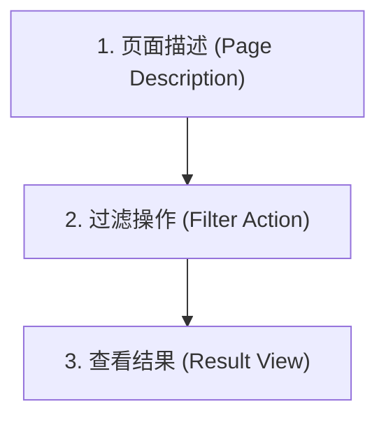

# 第三期 - 04. 系统介绍与极简沟通模板

## 一、极简沟通 4 大句型

在工作中，不需要使用过于复杂的长难句。掌握这 4 大基础骨架，就能应对 80% 的日常状态沟通：

### 1. 句型 A (反馈状态)：`[Something] is [Status/Adjective]`
用于描述某人或某物的当前状态（对应主系表结构）。
*   **实战 1**：The API is broken. (API 挂了。)
*   **实战 2**：The SQL script is ready. (SQL 脚本准备好了。)
*   **实战 3**：The weekly report is done. (周报完成了。)

### 2. 句型 B (表达需求)：`I need to + 动词原形`
用于表达你接下来要做什么，或需要什么操作。
*   **实战 1**：I need to fix the layout. (我需要修复一下布局。)
*   **实战 2**：I need to check the database. (我需要检查一下数据库。)

### 3. 句型 C (向人求助)：`Can you help me + 动词原形`
用于请求同事协助做某事。
*   **实战 1**：Can you help me check this code? (你能帮我检查一下这段代码吗？)
*   **实战 2**：Can you help me test this API? (你能帮我测试一下这个接口吗？)

### 4. 句型 D (确认情况)：`Is this + 名词`
用于向对方核实某样东西是否正确。
*   **实战 1**：Is this format correct? (这个格式正确吗？)
*   **实战 2**：Is this the true logic? (这是真实/实际的业务逻辑吗？)

---

## 二、介绍系统“三步法”模板

当需要向客户或团队演示一个新系统/页面时，可以使用以下标准的“三步法”来进行有条理的英文讲解：

### 1. 页面描述 (Page Description)
介绍当前是什么页面，以及它显示什么信息。
*   **句型**：`This is the [page name] page. It shows [what data/information].`
*   **实例**：This is the Dashboard page. It shows the machine status.
    *   **中文翻译**：这是仪表盘页面，它展示机器状态。
    *   **结构解析**：This (主语1) + is (系动词1) + the Dashboard page (表语1). It (主语2) + shows (谓语2，单三) + the machine status (宾语2).

### 2. 过滤操作 (Filter Action)
介绍用户可以在这里输入/选择什么，并点击什么按钮。
*   **句型**：`You can enter/select [input] here, and click [button].`
*   **实例**：You can enter the machine name here, and click Search.
    *   **中文翻译**：你可以在这里输入机器名，然后点击查询。
    *   **结构解析**：You (主语) + can enter (情态动词+动词原形作谓语1) + the machine name (宾语1) + [here] (地点状语), + and (连词) + [can] click (省略的情态动词与谓语2) + [Search] (Search在此作为按钮名称，作click的宾语)。

### 3. 查看结果 (Result View)
引导用户查看产生的数据或报表。
*   **句型**：`Here is the [result/report]. You can see [items].`
*   **实例**：Here is the report. It shows the total load count.
    *   **中文翻译**：这是报表，它展示了总加载数。
    *   **结构解析**：Here (副词作状语前置) + is (系动词) + the report (真正主语). It (主语2) + shows (谓语2) + the total load count (宾语2)。

---

## 三、实战演练 (Demo Speech)

将上述三步连贯起来，就是一段完美的系统演示汇报词：

> "Hi, everyone. **This is the weekly report page. It shows the statistics.** **You can enter the machine name, and select the start time. Then, click the search button.** **Here is the report. It shows the total load count.** Thank you."
>
> *(大家下午好。这是周报页面，它显示统计数据。您可以在这里输入机器名称并选择开始时间。然后，点击查询按钮。这里就是生成的报表，它显示了总加载数。谢谢大家。)*
