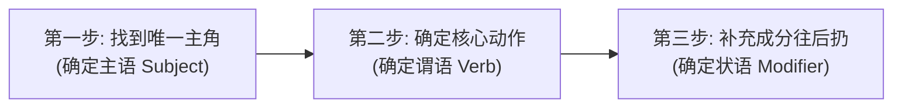

# 第四期 - 01. 中英思维差异与Debug法

## 一、中文和英文的思维差异

在进行技术沟通和日常交流时，我们经常会不自觉地将中文直译为英文。了解中英文底层的思维模式差异，能帮助我们写出更地道的表达：

### 1. 中文思维：意合 (Parataxis)
*   **结构特点**：依靠意思的并列拼凑，主语经常被省略。
    *   *全栈类比*：像 **JavaScript**（弱类型，即使不写分号、省略声明，代码依然能够“宽容”地运行）。
*   **动词使用**：喜欢使用一连串的动词（多动词连用）。
    *   *全栈类比*：像一连串的 `function()` 链式调用：`fetch().then().then()`。
*   **语序逻辑**：由大到小。先说大时间、大地点，最后说小时间、小地点（如：年 $\rightarrow$ 月 $\rightarrow$ 日）。

---

### 2. 英文思维：形合 (Hypotaxis)
*   **结构特点**：结构必须完整，主语、谓语、宾语三大骨架缺一不可。
    *   *全栈类比*：像 **C#**（强类型，少写一个括号或分号，编译器就会直接报错，无法运行）。
*   **动词使用**：**一个句子通常只有一个核心谓语动词**。其余动作必须通过名词、介词、不定式（to do）或分词（doing/done）进行“降级”表达。
*   **语序逻辑**：由小到大。先说具体的事件，然后把时间、地点、方式等修饰参数挂在句子最后面。

---

## 二、如何避免中文思维？（全栈工程师的 3 步 Debug 法）

要写出正确的英文句子，可以套用以下 3 步“Debug”流程：

### 1. 第一步：找到“唯一主角”（确定主语 Subject）
*   **中文痛点**：中文习惯说“发现了一个 bug”、“昨天更新了系统”（主语“谁”被隐藏了）。
*   **Debug**：写英文前，必须明确指出主角是谁（如：`I`, `We`, `The system`, `The script`）。

### 2. 第二步：确定“核心动作”（确定谓语 Verb）
*   **中文痛点**：中文喜欢堆砌动词，如“我去办公室写代码用 C#”。
*   **Debug**：在所有动作中找出**最核心**的一个。这里核心动作是“写（`write`）”，“去办公室”和“用C#”都要降级为介词短语修饰。

### 3. 第三步：补充成分往后扔（确定状语 Modifier）
*   **Debug**：将时间、地点、方式（用什么工具）等作为“附加参数”，通通挂在句子的最后面。
    *   *拼装结果*：`I (主) + write (谓) + code (宾) + [in the office] (地点) + [with C#] (方式) + [every day] (时间).`

---

## 三、实战测试 (Debug Test)

*   **中文原句**：“这个页面加载很慢，严重影响了用户体验。”
*   **直译误区**：*This page load very slow, seriously affect user experience.* (无主语 it，动词重叠，且缺少系动词)
*   **正确 Debug 组装**：
    *   *分句 1*：This page (主语) + is (系动词) + slow (表语).
    *   *分句 2*：It (主语，指代前句) + seriously (副词状语) + affects (谓语，单三) + user experience (宾语).
    *   *合句*：**This page is slow. It seriously affects user experience.**
        *   **结构解析**：前半句为“主系表”结构；后半句为“主谓宾”结构。
